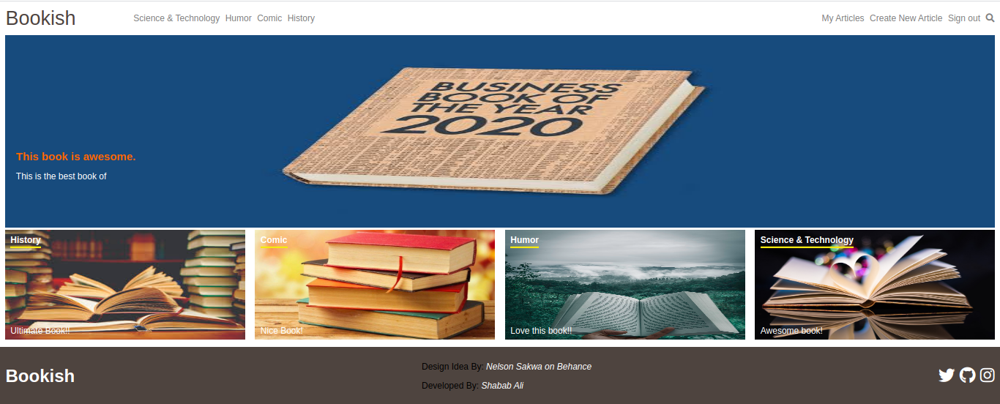

[](mailto:shababsaifi@gmail.com) [](https://twitter.com/shabab_ali)

# Bookish - Write articles about your favourite books.

> In this project, I developed a web application where a user can write articles about books. Application has RESTful routes. A user can sign up, login, create, edit and delete an article. Also user can see the articles by categories and written by others.
> Logged in user can upvote, downvote an article. Article with most number of votes is displayed in top row of homepage.
> The project is developed using Ruby on Rails and embedded ruby for templating.
> Navbar is dynamicaly generated from categories
> Unit tests and integration tests are written using RSpec and Capybara

## Built With

- Ruby v2.7.0
- Ruby on Rails v5.2.4.2
- Gems used for testing: Capybara, Rspec-Rails, Shoulda-matchers and FactoryBot.

## Live Demo
[Live Demo Link](https://shielded-river-22994.herokuapp.com/)


## Getting Started

To get a local copy up and running follow these steps:

### Prerequisites

- Ruby: 2.6.3
- Rails: 5.2.3
- Postgres: >=9.5
- Git

### Usage

- Fork/Clone this project to your local machine
- Open folder in your local enviroment and run thes lines of code to get started:

Install gems with:

```Ruby
    bundle install
```

Setup database with:

```Ruby
   rails db:create
   rails db:migrate
   rails db:seed
```

Start server with:

```Ruby
    rails server
```

Then open a web page and go to [port 3000 on your local machine.](http://localhost:3000)

### Running tests

```Ruby
    bundle exec rpsec --format documentation
```

### Deployment

Application is deployed on heroku.

## Author

👤 **Shabab Ali**

- Github: [@alishabab](https://github.com/alishabab)
- Twitter: [@shabab_ali](https://twitter.com/shabab_ali)
- LinkedIn: [shababali](https://www.linkedin.com/in/shababali/)
- Email: [shababsaifi@gmail.com](mailto:shababsaifi@gmail.com)

## 🤝 Contributing

Contributions and feature requests are welcome!

Start by:

- Forking the project
- Cloning the project to your local machine
- `cd` into the project directory
- Run `git checkout -b your-branch-name`
- Make your contributions
- Push your branch up to your forked repository
- Open a Pull Request with a detailed description to the development(or master if not available) branch of the original project for a review

## Show your support

Give a ⭐️ if you like this project!

## Acknowledgments

- Design Idea by [Nelson Sakwa on Behance](https://www.behance.net/sakwadesignstudio) 
- Project Requirement can be find [here](https://www.notion.so/Lifestyle-articles-b82a5f10122b4cec924cd5d4a6cf7561)
